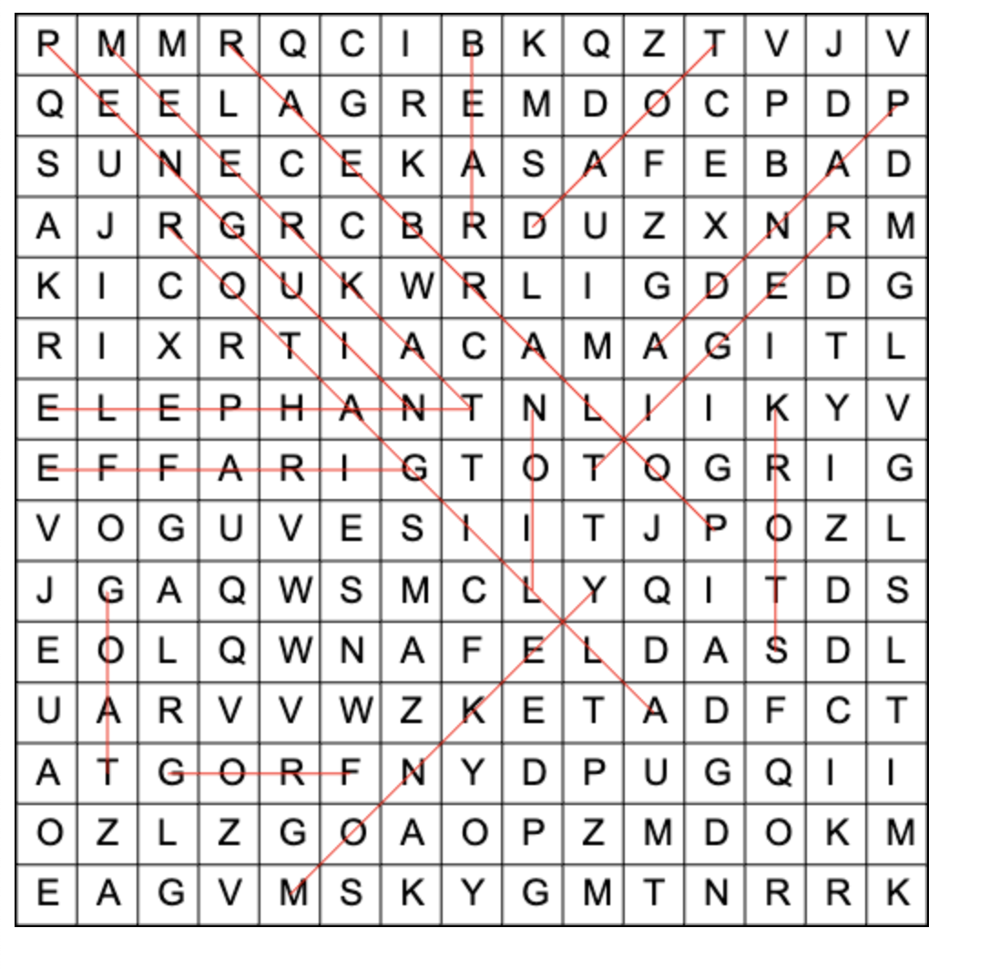

# WordSearch

This is a simple word finder for wordsearch puzzles. When elementary school teachers run out of stuff to teach they like to give these to occupy students time. Finally I have something that will do it for me. But it takes some time to type in the puzzle.
Perhaps an OCR tool would be cool to integrate with.

The input folder contains 2 files. The puzzle, and the list of words to search.
The output folder contains 2 files. One is data.js, the puzzle with its solution, generated by the java program. The html file is for rendering it with html5 canvas.

Here is sample output

